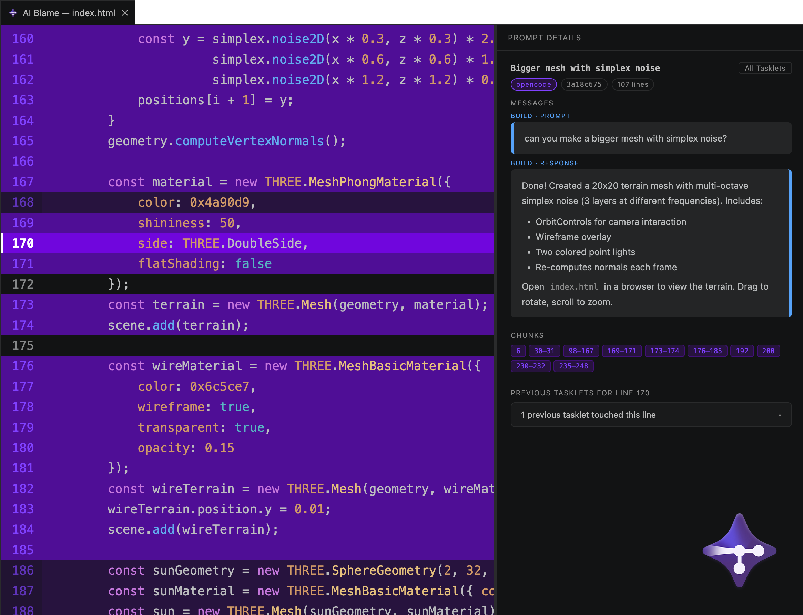

# Tracybot

[](https://github.com/TracyTeam/tracybot/releases/latest) 
[](LICENSE) 
[](https://github.com/TracyTeam/tracybot/actions/workflows/build-vs.yml) 
[](https://github.com/TracyTeam/tracybot/actions/workflows/build-oc.yml) 
[](https://github.com/TracyTeam/tracybot/actions/workflows/build-cc.yml) 
[](https://github.com/TracyTeam/tracybot/actions/workflows/build-codex.yml) 
[](https://marketplace.visualstudio.com/items?itemName=TracyTeam.tracybot-extension)



Tracybot is a tool that traces AI-generated code back to the prompts that created it. It enables tracking for AI-assisted development by recording snapshots of your codebase at each AI interaction.

## Features

- **AI Traceability** - Map AI-generated lines of code back to their originating prompt
- **Non-Invasive Storage** - Hidden Git commits and refs keep your history clean
- **Seamless Integration** - Works with OpenCode CLI, Claude Code, Codex CLI, and Visual Studio Code
- **Audit Trail** - Review AI interactions to verify, debug, or understand code origins
- **Team Sync** - Push traces to remote for team collaboration
- **Research Mode** - Optional, opt-in sharing of your Tasklet history for a research study on AI-assisted coding behavior — see [docs/research-mode.md](./docs/research-mode.md)

## Supported Agents and Editors

### Supported Agents
- **OpenCode CLI** — Install the [opencode-plugin](./opencode-plugin/README.md) to automatically record snapshots during AI interactions.
Requires OpenCode CLI to be installed - https://opencode.ai
- **Claude Code** — Install the [claude-code-plugin](./claude-code-plugin/README.md) to automatically record snapshots during AI interactions.
Requires Claude Code to be installed.
- **Codex CLI** — Install the [codex-plugin](./codex-plugin/README.md) to automatically record snapshots during AI interactions.
Requires Codex CLI to be installed.

### Supported Editors
- **VS Code** — Install the [vscode-extension](./vscode-extension/README.md) to view AI blame information. 
Available on the [VS Code Marketplace](https://marketplace.visualstudio.com/items?itemName=TracyTeam.tracybot-extension).


## Quick Start

### 1. Install the VS Code Extension

This is the entry point to Tracybot. The extension can open AI Blame, automatically initializes Tracybot in the current repository, and automatically installs plugins for any supported agent it detects on your machine.

You can install the extension directly within VS Code:
1. Open VS Code and go to the **Extensions** view (`Ctrl+Shift+X` or `Cmd+Shift+X`).
2. Search for `Tracybot`.
3. Click **Install**.

Alternatively, visit the [Tracybot VS Code Marketplace page](https://marketplace.visualstudio.com/items?itemName=TracyTeam.tracybot-extension) and follow the instructions on the marketplace page.

### 2. Open Your Repository in VS Code

When the extension activates, it adds an `AI Blame` status bar item on the right side of VS Code.

If Tracybot has not been initialized in the open repository yet, the extension initializes it automatically.

If you prefer to initialize from the terminal instead, run:

```bash
python /path/to/tracybot/init.py /path/to/your-target-repository
```

Requirements:
- A Git repository
- Python 3 available as `python3` or `python`
- An `origin` remote is optional; it is only needed for syncing Tracy refs and notes with a remote

### 3. Agent Plugins Install Automatically

If the VS Code extension is installed, it detects whichever supported agent CLIs you already have (OpenCode, Claude Code, Codex) and installs their plugins automatically. It also re-checks once a day, so an agent you install later gets picked up without needing to reload VS Code.

- **OpenCode** — [opencode-plugin](./opencode-plugin/README.md), installed at `~/.config/opencode/plugin/tracybot-oc.js`
- **Claude Code** — [claude-code-plugin](./claude-code-plugin/README.md), installed via hooks in `~/.claude/settings.json`
- **Codex CLI** — [codex-plugin](./codex-plugin/README.md), installed via hooks in `~/.codex/hooks.json`

Using more than one agent works fine — Tracybot records which one produced each Tasklet.

### 4. Start Using AI Blame

After your agent makes changes in an initialized repository, Tracybot records snapshots automatically. Click `AI Blame` in VS Code to inspect the prompt history behind the current file.

## Architecture

Tracybot consists of these components working together:

- **[opencode-plugin](./opencode-plugin/README.md)** - Plugin for OpenCode CLI that records snapshots during AI interactions
- **[claude-code-plugin](./claude-code-plugin/README.md)** - Hooks for Claude Code that record snapshots during AI interactions
- **[codex-plugin](./codex-plugin/README.md)** - Hooks for Codex CLI that record snapshots during AI interactions
- **[vscode-extension](./vscode-extension/README.md)** - VS Code extension to view AI blame information, and the opt-in Research Mode (see [docs/research-mode.md](./docs/research-mode.md))
- **[tracybot-tracking](./tracking/README.md)** - Git hooks and scripts for state tracking using hidden commits and synced git notes, shared by all three agent plugins

More information, including the requirements that resulted in these architectural decisions, are on the [wiki](https://github.com/TracyTeam/tracybot/wiki/Architecture).

## Troubleshooting

### Common Issues

**No AI blame information showing**
- Ensure the repository was initialized with `init.py`
- Verify VS Code extension is installed
- Check that your agent (OpenCode, Claude Code, or Codex) has already produced tracked changes in this repository

**Snapshots not being created**
- Check that the matching agent plugin is installed and loaded
- Verify Tracybot was initialized successfully in the repository
- Verify Git hooks are installed under `.git/hooks/`
- Check for errors in the agent's output

**Push sync not working**
- Ensure an `origin` remote is configured
- Check that the `pre-push` hook is installed
- Verify Git notes are being pushed

## Getting Started for Developers

### Initialize a Repository Manually

```bash
python ./init.py /path/to/target-repository
```

If you run `init.py` from inside a Git repository, you can omit the explicit path.

### Work on the VS Code Extension

```bash
cd vscode-extension
npm install
npm run compile
```

Open `vscode-extension` in VS Code and press `F5` to launch the extension host.

### Work on the OpenCode Plugin

```bash
cd opencode-plugin
bun install
bun run deploy
```

`bun run deploy` builds the plugin and installs it into the global OpenCode plugin directory.

### Work on the Claude Code Plugin

```bash
cd claude-code-plugin
bun install
bun run deploy
```

`bun run deploy` builds the plugin and adds its hooks to `~/.claude/settings.json`, without touching any hooks you already have configured there.

### Work on the Codex Plugin

```bash
cd codex-plugin
bun install
bun run deploy
```

`bun run deploy` builds the plugin and adds its hooks to `~/.codex/hooks.json`, without touching any hooks you already have configured there.

### Manual Installation from Release Assets

If you are testing packaging or release artifacts manually:

1. Download `vscode-extension.vsix` from the [latest release](https://github.com/TracyTeam/tracybot/releases/latest) and install it with `code --install-extension vscode-extension.vsix` or VS Code's `Install from VSIX...` action.
2. Download `tracybot-oc.js` from the same release and place it in either `~/.config/opencode/plugin/` or `<repo>/.opencode/plugin/`.
3. Download `tracybot-cc-hook.js` (Claude Code) or `tracybot-codex-hook.js` (Codex) from the same release, and register hooks pointing at it in `~/.claude/settings.json` or `~/.codex/hooks.json` respectively — see each plugin's README for the exact hook configuration.
