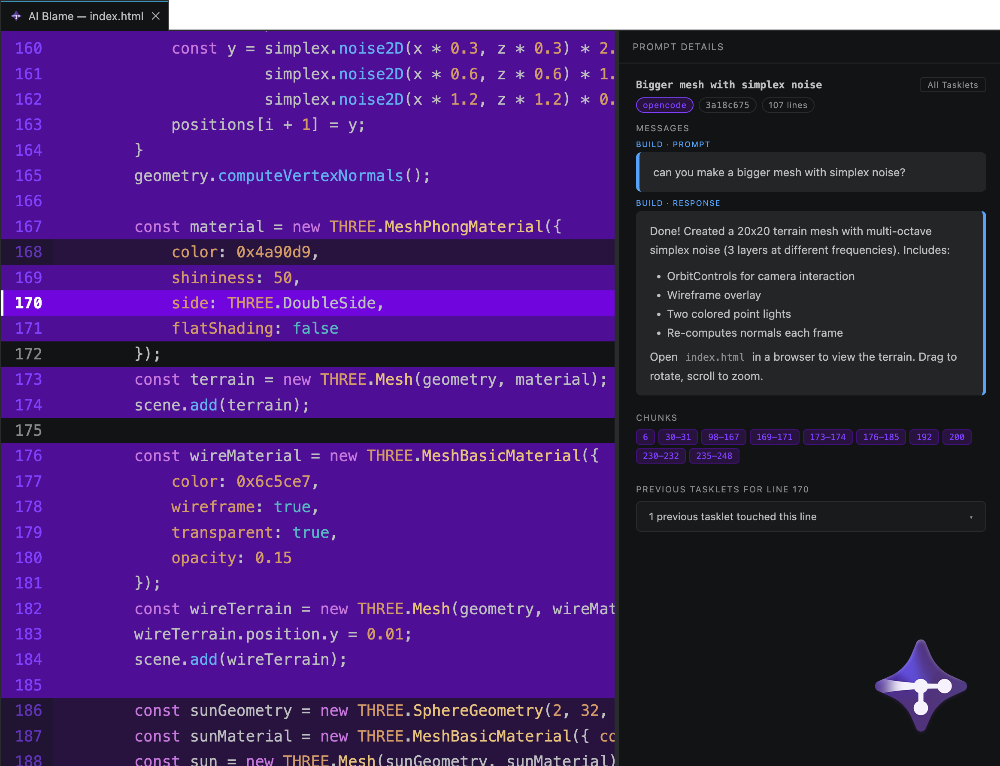

# Tracybot VS Code Extension



A VS Code extension that traces AI generated code back to prompts by displaying original prompts.

## What It Does

The extension queries the Git repository to reconstruct the history of AI interactions by:
1. Reading hidden commits from `refs/tracy/*` and the active local chain in `refs/tracy-local/*` when present
2. Extracting metadata from commit objects
3. Building a timeline that maps code changes to AI interactions

## Installation

Installing the extension is the recommended way to get started with Tracybot.

### Linux and macOS

```bash
curl -fsSL https://raw.githubusercontent.com/TracyTeam/tracybot/main/vscode-extension/install.sh | bash
```

### Windows

```powershell
irm https://raw.githubusercontent.com/TracyTeam/tracybot/main/vscode-extension/install.ps1 | iex
```

The install scripts use the `code` CLI, so make sure the VS Code command line tools are available first.

## Usage

1. Open a Git repository in VS Code.
2. If Tracybot has not been initialized in that repository yet, the extension offers to run initialization for you.
3. If the OpenCode plugin is missing, the extension offers to install it globally or for the current workspace.
4. Click the `AI Blame` status bar item, or run `Tracybot: Open AI Blame window` from the command palette.

## Requirements

- VS Code 1.110.0 or later
- A Git repository

Node.js and npm are only required for developing the extension from source.

## AI Blame Tab

Displays the history of AI-generated code changes in a dedicated editor tab. The `AI Blame` button is shown in the right side of the VS Code status bar.

- **Highlighted lines**: Each file highlights AI-generated lines
- **Tasklet details**: Click on any highlighted line to see the originating tasklet
  - A tasklet consists of 0 or more plan prompts followed by a build prompt and contains both user prompts and AI responses
  - A tasklet Zod schema is available under `src/history/types.ts`
- **File history**: View all tasklets that modified the current version of the file

## Keybindings

- `Cmd+Shift+0` (Mac) / `Ctrl+Shift+0` (Windows/Linux) - Open AI Blame window

## Getting Started for Developers

### Install Dependencies

```bash
npm install
```

### Build the Extension

```bash
npm run compile
```

### Launch in Debug Mode

Open `src/extension.ts` in VS Code and press `F5` to launch the extension debugger.

### Install a Packaged VSIX Manually

Download `vscode-extension.vsix` from the [latest release](https://github.com/TracyTeam/tracybot/releases/latest) and install it with:

```bash
code --install-extension vscode-extension.vsix
```
